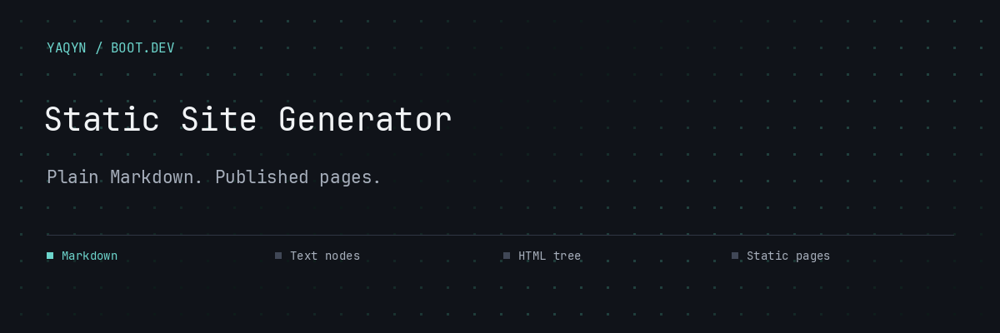
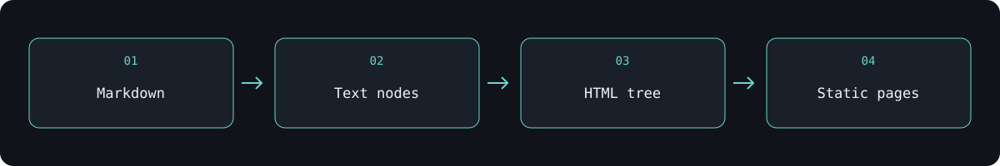

# Static Site Generator

**A Python static site generator that turns Markdown into a linked website.**

Write content in Markdown, add static assets, and build HTML pages through a shared template. The included Tolkien-themed site demonstrates nested blog routes, images, inline formatting, and navigation.

##  Build and preview locally

Requires **Python 3**. No third-party dependencies.

```bash
sh main.sh
```

Open **http://localhost:8888**. This regenerates `docs/` and starts Python’s HTTP server. Stop the server with **Ctrl+C**.


<sub>Artwork from the bundled example site. See [the source homepage](content/index.md) for the content it accompanies.</sub>

##  Markdown becomes a page tree



Inline parsing handles text, links, images, code, bold, and italics. Block parsing produces headings, paragraphs, quotes, lists, and code blocks. Recursive generation preserves the content directory’s route structure.

| Location | Purpose |
| --- | --- |
| `content/` | Markdown pages and nested blog posts |
| `static/` | Stylesheet and images |
| `template.html` | Shared page shell |
| `src/` | Parsers, HTML nodes, generation, and tests |
| `docs/` | Generated site output |

##  Publish with the correct base path

```bash
sh build.sh
```

The build script uses `/my-site/` as its base path for project-site hosting. For another deployment path, pass it directly:

```bash
python3 src/main.py "/your-project/"
```

Generation replaces `docs/`, copies `static/`, and renders the Markdown pages. Edit the source content and assets rather than generated HTML.

##  Check the parser and generator

```bash
sh test.sh
```

The unittest suite covers inline and block parsing, HTML nodes, and page generation. This project develops recursion, composition, and the boundary between source content and generated output.

---

Built by **[Abdulrahman M. Yaqyn](https://yaqyn.dev)** through the [Boot.dev](https://www.boot.dev) curriculum.
