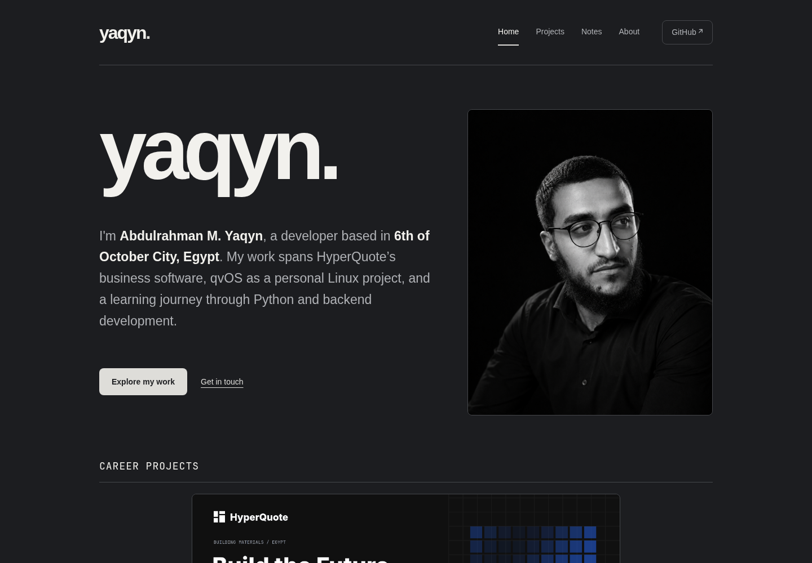

# Folio — Personal Site & Generator

**Abdulrahman M. Yaqyn's projects and development notes, powered by a small Python static site generator.**

A graphite and charcoal theme, the author’s original black-and-white portrait, and personal content drawn from the [GitHub profile README](https://github.com/yaqyn/yaqyn). All eight projects appear on the homepage and Projects page with their current names and repository links. The site includes projects, about, contact, notes, and a custom 404 page.

[Visit the published site](https://yaqyn.github.io/folio-static-site/) · [Design context](DESIGN.md)

##  Projects

| Project | Purpose |
| --- | --- |
| [HyperQuote](https://github.com/yaqyn/HyperQuote) | Connected Business Operations |
| [qvOS](https://github.com/yaqyn/qvOS) | Personal Linux Distribution |
| [Workbench](https://github.com/yaqyn/workbench-ai-agent) | AI Coding Agent |
| [CineSearch](https://github.com/yaqyn/cinesearch-rag-engine) | Movie RAG Engine |
| [SiteLens](https://github.com/yaqyn/sitelens-web-crawler) | Web Crawler |
| [Orbit](https://github.com/yaqyn/orbit-asteroids-game) | Asteroids Game |
| [TextScope](https://github.com/yaqyn/textscope-text-analyzer) | Text Analyzer |
| [Folio](https://github.com/yaqyn/folio-static-site) | Personal Site & Generator |

##  One-line launch

Requires **Python 3.10+**. No third-party runtime dependencies.

```bash
./launch
```

Open **http://127.0.0.1:8888**. The launcher builds a local version and serves it on the loopback interface. Stop with **Ctrl+C**. Use `./launch 8891` for another port. It works from any directory when invoked by absolute path; `sh main.sh` remains an alias.

##  Write and build

| Location | Purpose |
| --- | --- |
| `content/` | Markdown pages and development notes |
| `static/` | Shared styles, favicon, and the original author portrait |
| `template.html` | Navigation, landmarks, metadata, and footer |
| `src/` | Parser, HTML tree, staged build, and tests |
| `docs/` | Generated output used by GitHub Pages |

Markdown supports headings, paragraphs, quotes, lists, links, images, bold, italics, inline code, and fenced code with optional language labels. Blank lines inside code fences are preserved. Raw HTML is escaped rather than executed.

Pages may start with a small frontmatter block:

```markdown
---
description: A useful one-sentence page description.
layout: page
---
# Page title
```

Supported keys are `description` and `layout`; layouts are `page` and `home`. This is a deliberately small key-value format, not a full YAML parser. The homepage's first three paragraphs are its introduction, actions, and image. Keep that order when editing its content.

Build for the existing GitHub Pages project path:

```bash
sh build.sh
```

Or choose another base path, output, and canonical public URL:

```bash
python3 src/main.py /portfolio/ --output /tmp/portfolio --site-url https://example.com/portfolio
```

Builds stage assets and pages in a temporary directory before replacing generated output. A broken Markdown page leaves the previous build intact. Existing custom output directories need a `.nojekyll` marker; the generator protects the project, source, and Git directories. Edit sources rather than generated HTML. Regenerate `docs/` with `sh build.sh` before committing for publication.

Local links receive the selected base path; external and protocol-relative links retain their destinations. Text and attributes are HTML-escaped, and unsupported link/image schemes are rejected. Every page has a description, canonical URL, social metadata, and selected navigation.

##  Verify

```bash
sh test.sh
```

The unittest suite covers parsing, HTML nodes, page generation, frontmatter, escaping, link schemes, code fences, all local routes and assets, and recovery from a failed build. GitHub Actions tests Python 3.10 and 3.13 and checks that the published build is reproducible.

The responsive theme has been checked in an isolated Chromium browser at desktop, 390px, and 320px widths, including keyboard skip navigation, project/note links, reduced motion, and the 404 recovery page. The site uses no JavaScript or remote fonts.

---

Built by **[Abdulrahman M. Yaqyn](https://github.com/yaqyn)** through the [Boot.dev](https://www.boot.dev) curriculum.
